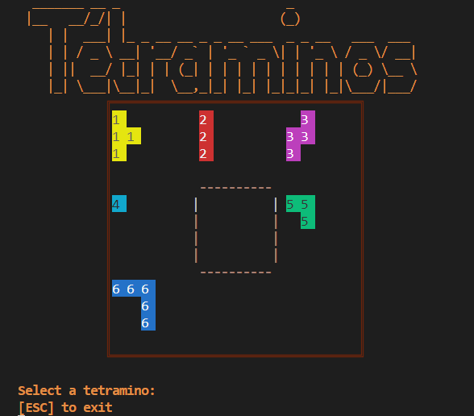

<h1 align="center">
📖 tetramino | Ulb
</h1>

## 📝 Table of contents
- [Table of contents](#📝-table-of-contents)
- [About the project](#💡-about-the-project)
- [Getting started](#🏁-getting-started)
  - [Prerequisites](#prerequisites)
  - [Installation](#installation)
- [Usage](#📖-usage)
- [Authors](#👤-authors)
- [License](#📜-license)

## 💡 About the project
This project is a tetramino game made in python for the course of algorithmic and programming at the ULB.

## 🏁 Getting started
### Prerequisites
- Python 3.8.5

### Installation
1. Clone the repository
```sh
git clone https://github.com/stanislas1200/tetramino.git
```

## 📖 Usage
```sh
python3 tetramino.py carte_1.txt
```



## 👤 Authors
- [**Godin Stanislas**]() - *Developer*

## 📜 License
This project is licensed under the MIT License - see the [LICENSE](LICENSE) file for details.
